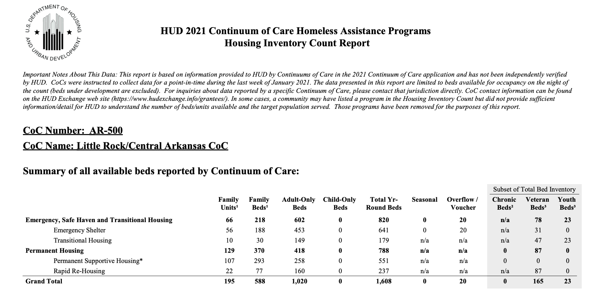
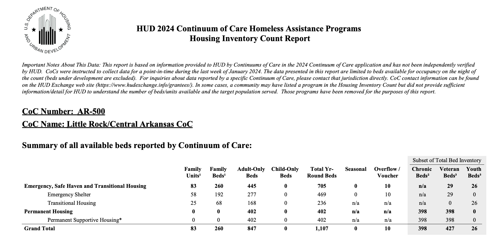

<link rel="preconnect" href="https://fonts.googleapis.com">
<link rel="preconnect" href="https://fonts.gstatic.com" crossorigin>
<link href="https://fonts.googleapis.com/css2?family=Bebas+Neue&family=Montserrat:wght@400;500;600;700&display=swap" rel="stylesheet">

## Introduction
The City of Little Rock Department of Housing and Neighborhood Programs recently launched a survey asking residents to share their priorities to help develop the 2026–2030 Consolidated Plan. 

The survey would:

- Guide Funding: directly determines how the city allocates federal funds for community development.
- Shape Policy: help local leadership understand the real needs of neighborhoods across Little Rock.

```{r setup, include=FALSE}
knitr::opts_chunk$set(
  echo = FALSE,
  message = FALSE,
  warning = FALSE
)

library(dplyr)
library(DT)
library(readxl)
library(ggplot2)
```
## ZIP Code Responses
A total of **259** Little Rock residents completed the survey, providing critical neighborhood-level data. Engagement was led by the **72205** ZIP code, establishing a strong baseline for localized community insights.

### Responses by Zip Code
```{r Zip Code}
# Packages
library(dplyr)
library(ggplot2)
library(knitr)
library(kableExtra)
library(readxl)
library(kableExtra)
library(DT)

# Read the data
library(readxl)
Housing_Community_Development_Survey_1_262_ <- read_excel("~/Downloads/Housing & Community Development Survey(1-262).xlsx")
survey_data<-Housing_Community_Development_Survey_1_262_

# Create ZIP to County mapping for Arkansas
zip_to_county <- data.frame(
  zip_code = c(72202, 72201, 72203, 72204, 72205, 72206, 72207, 72209, 
               72210, 72211, 72212, 72223, 72227,  
               72103, 72106, 72114, 72116, 72117, 72118, 72120, 
               72019, 72022, 72113, 72135, 72295, 71603),
  county = c(rep("Pulaski County", 13),  
             rep("Pulaski County", 7),   
             "Faulkner County", "Faulkner County", "Pulaski County", 
             "Pulaski County", "Lonoke County", "Pine Bluff/Jefferson County")
)

# Add county column to survey data
survey_data <- survey_data %>%
  rename(zip_code = `What is your ZIP code?`) %>%
  mutate(zip_code = as.numeric(zip_code)) %>%  # Convert to numeric
  left_join(zip_to_county, by = "zip_code")

# Create summary table of ZIP code counts
zip_table <- survey_data %>%
  count(zip_code, county) %>%
  arrange(desc(n)) %>%
  rename(`ZIP Code` = zip_code, 
         County = county, 
         `Number of Respondents` = n)

# Data table of zipcodes
datatable(zip_table, 
          filter = 'top',
          options = list(pageLength = 23),
          caption = "Survey Respondents by ZIP Code")

```
### Responses by County
The geographical distribution below confirms that most respondents reside within Pulaski County, consistent with Little Rock's city boundaries.
```{r county-pie-interactive, echo=FALSE, message=FALSE, warning=FALSE}
library(plotly)

county_summary <- survey_data %>%
  dplyr::count(county) %>%
  dplyr::arrange(dplyr::desc(n)) %>%
  dplyr::mutate(
    percentage = round(n / sum(n) * 100, 1),
    label_text = paste0(county, ": ", n, " (", percentage, "%)")
  )

plot_ly(
  data = county_summary,
  labels = ~county,
  values = ~n,
  type = "pie",
  text = ~label_text,
  textinfo = "text",
  textposition = "outside",
  automargin = TRUE,
  hovertemplate = paste(
    "<b>%{label}</b><br>",
    "Responses: %{value}<br>",
    "Percent: %{percent}<extra></extra>"
  ),
  marker = list(
    colors = c("#00173d", "#076201", "#429cf0", "#f9c610", "#7a7a7a"),
    line = list(color = "#FFFFFF", width = 2)
  ),
  domain = list(x = c(0, 1), y = c(0, 0.88))
) %>%
  layout(
    title = list(
      text = "Survey Respondents by County",
      x = 0.5,
      y = 0.98,
      xanchor = "center",
      yanchor = "top",
      font = list(size = 20, color = "#00173d")
    ),
    margin = list(t = 120, b = 40, l = 40, r = 40),
    showlegend = FALSE
  )
```
### Map of Responses by Zip Code
The geographic distribution of responses shows a clear concentration in central Little Rock, with the highest response counts occurring in ZIP codes located within or near the city boundary. Responses from surrounding communities also appear across the broader region, suggesting that the survey captured not only city residents but also individuals from nearby areas who may commute into Little Rock for work, services, or other daily activities.
```{r zip-map-interactive, echo=FALSE, message=FALSE, warning=FALSE}
library(dplyr)
library(sf)
library(tigris)
library(leaflet)

options(tigris_use_cache = TRUE)

# Count responses by ZIP code
zip_counts <- survey_data %>%
  dplyr::count(zip_code, name = "responses") %>%
  dplyr::mutate(zip_code = sprintf("%05d", zip_code))

# Pull Arkansas ZCTA boundaries using 2020 Census geography
ar_zctas <- tigris::zctas(cb = TRUE, starts_with = c("72"), year = 2020) %>%
  sf::st_transform(4326)

# Join ZIP counts to map polygons
zip_map <- ar_zctas %>%
  dplyr::filter(ZCTA5CE20%in% zip_counts$zip_code) %>%
  dplyr::left_join(zip_counts, by = c("ZCTA5CE20" = "zip_code"))

# Pull Arkansas place boundaries and isolate Little Rock
ar_places <- tigris::places(state = "AR", cb = TRUE, year = 2020) %>%
  sf::st_transform(4326)

little_rock <- ar_places %>%
  dplyr::filter(NAME == "Little Rock")

# Make geometries valid
zip_map <- sf::st_make_valid(zip_map)
little_rock <- sf::st_make_valid(little_rock)

# Create blue-to-yellow palette
pal <- leaflet::colorNumeric(
  palette = c("#0b3c8c", "#2f6db3", "#6aaed6", "#f3d34a", "#f9e721"),
  domain = zip_map$responses,
  na.color = "#d9d9d9"
)

# Build interactive map
leaflet() %>%
  addProviderTiles(providers$CartoDB.Positron) %>%
  setView(lng = -92.2896, lat = 34.7465, zoom = 10) %>%
  addPolygons(
    data = zip_map,
    fillColor = ~pal(responses),
    color = "white",
    weight = 1,
    fillOpacity = 0.75,
    smoothFactor = 0.2,
    popup = ~paste0(
      "<b>ZIP Code:</b> ", ZCTA5CE20, "<br>",
      "<b>Responses:</b> ", responses
    ),
    label = ~paste0("ZIP ", ZCTA5CE20, ": ", responses, " responses")
  ) %>%
  addPolygons(
    data = little_rock,
    fill = FALSE,
    color = "#111111",
    weight = 3,
    opacity = 1,
    label = ~paste0(NAME, " city boundary")
  ) %>%
  addLegend(
    position = "bottomright",
    pal = pal,
    values = zip_map$responses,
    title = "Responses",
    opacity = 1
  )
```

## Survey Respondent Profile
The following section analyzes the profile of the survey respondents by asking the following questions: 

- How many people live in your household (including yourself)?
- What is your approximate total household income?
- Which of the following best describes your race or ethnicity? (Select all that apply)
- Which of the following best describes your family or household type?
- Which best describes your current housing situation?

### How many people live in your household (including yourself)?
The most common household size among respondents was two people, reported by 108 respondents.
```{r household_size, echo=FALSE, message=FALSE, warning=FALSE}
library(dplyr)
library(ggplot2)
library(plotly)

household_size_plot_data <- survey_data %>%
  filter(!is.na(`How many people live in your household (including yourself)?`)) %>%
  mutate(
    household_size = as.character(`How many people live in your household (including yourself)?`)
  ) %>%
  filter(household_size != "") %>%
  count(household_size) %>%
  mutate(
    fill_color = ifelse(household_size == "2", "#f9c610", "#00173d"),
    label_y = n + 2
  )

household_size_plot <- ggplot(
  household_size_plot_data,
  aes(
    x = household_size,
    y = n,
    text = paste0(
      "Household size: ", household_size,
      "<br>Number of responses: ", n
    )
  )
) +
  geom_col(aes(fill = I(fill_color))) +
  geom_text(aes(y = label_y, label = n), fontface = "bold") +
  labs(
    title = "Household Size of Respondents",
    x = "Number of People in Household",
    y = "Number of Respondents"
  ) +
  scale_y_continuous(expand = expansion(mult = c(0, 0.08))) +
  theme_minimal() +
  theme(
    plot.title = element_text(face = "bold"),
    axis.title = element_text(face = "bold"),
    panel.grid = element_blank(),
    axis.line = element_line(color = "black"),
    axis.ticks = element_line(color = "black")
  )

ggplotly(household_size_plot, tooltip = "text") %>%
  config(displayModeBar = FALSE)
```

### What is your approximate total household income?
The survey captured a total of 259 valid responses regarding household income. The distribution shows that the ***largest group of respondents*** (85, or 33%) reported household incomes over **$100,000**, followed by ***45 respondents (17%)*** in the **$25,000–$50,000** range and ***43 respondents (17%)*** in the **$75,000–$100,000** range. Notably, 36 respondents (14%) preferred not to disclose their income.

**Important Context:** The income distribution observed in this survey skews higher than Little Rock's median household income of approximately $52,000 for a two-person household. This discrepancy likely reflects two key factors: ***(1) the survey included respondents from outside the City of Little Rock boundaries, including suburban areas with higher median incomes***, and ***(2) the survey methodology may have reached more engaged stakeholders such as homeowners, city employees, and nonprofit representatives, who tend to have higher incomes than the general population.***

```{r Income_Plot,  echo=FALSE, message=FALSE, warning=FALSE}
rm(list = intersect(c("household_income_plot_data", "household_income_plot"), ls()))

income_plot_data_new <- survey_data %>%
  filter(!is.na(`What is your approximate total household income?`)) %>%
  transmute(income_raw = as.character(`What is your approximate total household income?`)) %>%
  count(income_raw, name = "n") %>%
  mutate(
    income_label = dplyr::recode(
      income_raw,
      "Under 25,000" = "Under $25,000",
      "25,00050,000" = "$25,000–$50,000",
      "50,00075,000" = "$50,000–$75,000",
      "75,000100,000" = "$75,000–$100,000",
      "Over 100,000" = "Over $100,000",
      "Prefer not to say" = "Prefer not to say"
    ),
    income_label = factor(
      income_label,
      levels = c(
        "Under $25,000",
        "$25,000–$50,000",
        "$50,000–$75,000",
        "$75,000–$100,000",
        "Over $100,000",
        "Prefer not to say"
      )
    ),
    label_y = n + 2
  ) %>%
  arrange(income_label)

income_plot_new <- ggplot(
  income_plot_data_new,
  aes(
    x = income_label,
    y = n,
    text = paste0(
      "Income range: ", income_label,
      "<br>Number of responses: ", n
    )
  )
) +
  geom_col(fill = "#00173d") +
  geom_text(aes(y = label_y, label = n), fontface = "bold") +
  labs(
    title = "Approximate Total Household Income of Respondents",
    x = "Income Range",
    y = "Number of Respondents"
  ) +
  scale_y_continuous(expand = expansion(mult = c(0, 0.08))) +
  theme_minimal() +
  theme(
    plot.title = element_text(face = "bold"),
    axis.title = element_text(face = "bold"),
    panel.grid = element_blank(),
    axis.line = element_line(color = "black"),
    axis.ticks = element_line(color = "black"),
    axis.text.x = element_text(angle = 20, hjust = 1)
  )

ggplotly(income_plot_new, tooltip = "text") %>%
  config(displayModeBar = FALSE)
```

### Which of the following best describes your race or ethnicity? (Select all that apply)
The racial and ethnic composition of survey respondents reflects Little Rock's diverse community. White respondents represented the largest single group with 129 responses, followed by Black or African American respondents with 94 responses. A smaller number of respondents identified as Hispanic or Latino (9 responses), Asian (1 response), or selected multiple racial/ethnic categories to describe their identity. Notably, 20 respondents preferred not to disclose their race or ethnicity.
```{r Race_Plot,  echo=FALSE, message=FALSE, warning=FALSE}
library(dplyr)
library(stringr)
library(ggplot2)
library(plotly)

race_counts <- survey_data %>%
  mutate(
    race = str_trim(`Which of the following best describes your race or ethnicity? (Select all that apply)`),
    race = str_remove(race, ";$")
  ) %>%
  filter(!is.na(race), race != "", race != "(Blanks)") %>%
  count(race, name = "responses", sort = TRUE) %>%
  mutate(race = factor(race, levels = rev(race)))

race_count <- ggplot(
  race_counts,
  aes(
    x = race,
    y = responses,
    text = paste0(race, ": ", responses)
  )
) +
  geom_col(fill = "#00173d", width = 0.8) +
  coord_flip() +
  scale_y_continuous(expand = expansion(mult = c(0, 0.05))) +
  labs(
    title = "Race/Ethnicity of Respondents",
    subtitle = "(Respondents could select multiple categories)",
    x = NULL,
    y = "Number of Respondents"
  ) +
  theme_minimal() +
  theme(
    plot.title = element_text(face = "bold"),
    plot.subtitle = element_text(size = 10, color = "gray40"),
    axis.title = element_text(face = "bold"),
    panel.grid = element_blank(),
    axis.line = element_line(color = "black"),
    axis.ticks = element_line(color = "black")
  )

ggplotly(race_count, tooltip = "text")
```

### Which best describes your current housing situation?
The overwhelming majority of survey respondents are homeowners, with **199 respondents (77%)** reporting that they **own** their homes. This was followed by **47 renters (18%)**, while a small number of respondents reported living with family or friends without paying rent (7 respondents, 3%). Additionally, 5 respondents preferred not to disclose their housing situation, and **1 respondent** reported **experiencing homelessness**.
```{r Housing_Sit, echo=FALSE, message=FALSE, warning=FALSE}
housing_situation_counts <- survey_data %>%
  mutate(
    housing_situation = str_trim(`Which best describes your current housing situation?`)
  ) %>%
  filter(!is.na(housing_situation), housing_situation != "", housing_situation != "(Blanks)") %>%
  count(housing_situation, name = "responses", sort = TRUE) %>%
  mutate(
    housing_situation = factor(housing_situation, levels = rev(housing_situation)),
    label_y = responses + 8
  )

housing_plot <- ggplot(
  housing_situation_counts,
  aes(
    x = housing_situation,
    y = responses,
    text = paste0(housing_situation, ": ", responses)
  )
) +
  geom_col(fill = "#00173d", width = 0.8) +
  geom_text(aes(y = label_y, label = responses), fontface = "bold", hjust = 0, size = 3.5) +
  coord_flip() +
  scale_y_continuous(expand = expansion(mult = c(0, 0.10))) +
  labs(
    title = "Current Housing Situation of Respondents",
    x = NULL,
    y = "Number of Respondents"
  ) +
  theme_minimal() +
  theme(
    plot.title = element_text(face = "bold"),
    axis.title = element_text(face = "bold"),
    panel.grid = element_blank(),
    axis.line = element_line(color = "black"),
    axis.ticks = element_line(color = "black")
  )

ggplotly(housing_plot, tooltip = "text")
```

## Housing Activities Rating
Respondents were asked to rate the level of need for 19 different housing investment categories on a scale from "No Need" to "High Need." The data reveals strong consensus around several key priorities.

**Top Investment Priorities (Highest "High Need" Ratings):**

- The three housing investments with the most "High Need" responses were:
- First-time home-buyer assistance (162 respondents, 63%)
- Construction of new affordable housing for home ownership (159 respondents, 61%)
- Construction of new affordable rental housing (155 respondents, 60%)

**Additional High-Priority Needs:**

Beyond the top three, respondents also indicated strong need for:

- Energy efficiency improvements (149 High Need, 58%)
- ADA (Americans with Disabilities Act) improvements (138 High Need, 53%)
- Heating/cooling HVAC replacement or repairs (119 High Need, 46%)


Important Context: Given that ***77% of survey respondents are homeowners***, the high ratings for homeownership-related programs (first-time buyer assistance, new affordable ownership housing) may reflect respondents' desire to help others achieve homeownership rather than addressing their own immediate housing needs. The strong support for rental housing construction and assistance programs demonstrates recognition of broader community needs beyond the respondent pool's predominant housing tenure.
```{r Housing_Needs_Table, echo=FALSE, message=FALSE, warning=FALSE}
library(dplyr)
library(tidyr)
library(DT)

housing_questions <- c(
  "Supportive housing for people who are experiencing homelessness",
  "Energy efficiency improvements",
  "First-time home-buyer assistance",
  "Homeownership for racial and ethnic minority populations",
  "Housing located adjacent or near transportation options",
  "Homeowner housing rehabilitation",
  "Supportive housing for people who have disabilities",
  "Rental housing for very low-income households",
  "ADA (Americans with Disabilities Act) improvements",
  "Construction of new affordable housing for home ownership",
  "Retrofitting existing housing to meet seniors’ needs",
  "Rental assistance",
  "Heating/cooling HVAC replacement or repairs",
  "Senior Citizen Housing",
  "Rental housing rehabilitation",
  "Construction of new affordable rental housing",
  "Preservation of federal subsidized housing",
  "Housing demolition",
  "Mixed income housing",
  "Mixed use housing"
)

housing_needs_summary <- survey_data %>%
  select(all_of(housing_questions)) %>%
  pivot_longer(
    cols = everything(),
    names_to = "Question",
    values_to = "Response"
  ) %>%
  mutate(
    Response = as.character(Response),
    Response = trimws(Response),
    Response = case_when(
      is.na(Response) | Response == "" | Response == "NA" ~ "Missing",
      grepl("Don.?t Know", Response, ignore.case = TRUE) ~ "Don't Know",  # Pattern matching
      TRUE ~ Response
    ),
    Response = factor(
      Response,
      levels = c("No Need", "Low Need", "Medium Need", "High Need", "Don't Know", "Missing")
    )
  ) %>%
  count(Question, Response, .drop = FALSE) %>%
  pivot_wider(
    names_from = Response,
    values_from = n,
    values_fill = 0
  )

datatable(
  housing_needs_summary,
  filter = "top",
  options = list(
    pageLength = 20,
    scrollX = TRUE,
    autoWidth = TRUE
  ),
  caption = "Housing Activities - Response Summary"
)
```


## Development and Preservation Needs
Respondents were asked to rate their level of agreement with 19 potential barriers that prevent access to affordable housing in Little Rock, using a scale from "Strongly Disagree" to "Strongly Agree".

**The barriers with the highest combined agreement were:**

- Cost of materials (212 combined agree, 82% of respondents)
- Cost of labor (201 combined agree, 78% of respondents)
-Lack of affordable housing development incentives (190 combined agree, 73% of respondents)
- Not In My Back Yard (NIMBY) mentality (184 combined agree, 71% of respondents)
- Lack of affordable housing development policies (177 combined agree, 68% of respondents)
- Cost of land or lot (172 combined agree, 66% of respondents)


```{r Barriers_Table, echo=FALSE, message=FALSE, warning=FALSE}


# List of all barrier questions
barrier_questions <- c(
  "Not In My Back Yard (NIMBY) mentality",
  "Not In My Back Yard NIMBY mentality",  # Try without parentheses
  "Lack of property maintenance code enforcement",
  "Lack of street lighting",
  "Cost of materials",
  "Cost of labor",
  "Lack of understanding of property caretaking",
  "Lack of affordable housing development incentives",
  "Lack of affordable housing development policies",
  "Lack of police patrol",
  "Density or other zoning requirements",
  "Cost of land or lot",
  "Permitting process",
  "Permitting/Construction fees",
  "PermittingConstruction fees",  # Try without slash
  "Planning site plan review and approval process",
  "Planning (site plan) review and approval process",  # Try with parentheses
  "Lack of qualified contractors or builders",
  "Building codes",
  "Lot size",
  "ADA codes",
  "Lack of available land"
)

# Create summary table
barriers_summary <- survey_data %>%
  select(any_of(barrier_questions)) %>%
  pivot_longer(
    cols = everything(),
    names_to = "Question",
    values_to = "Response"
  ) %>%
  mutate(
    Response = case_when(
      is.na(Response) ~ "Missing",
      Response == "" ~ "Missing",
      TRUE ~ as.character(Response)
    )
  ) %>%
  count(Question, Response) %>%
  pivot_wider(
    names_from = Response,
    values_from = n,
    values_fill = 0
  )

# Reorder columns if they exist
col_order <- c("Question", "Strongly Agree", "Agree", "Neither Agree or Disagree", 
               "Disagree", "Strongly Disagree", "Missing")
existing_cols <- intersect(col_order, names(barriers_summary))
barriers_summary <- barriers_summary %>%
  select(all_of(existing_cols))

# Display interactive table
datatable(
  barriers_summary,
  filter = 'top',
  options = list(
    pageLength = 20,
    scrollX = TRUE,
    autoWidth = TRUE
  ),
  caption = "Development and Preservation Needs - Response Summary"
)
```

## Infrastructure Activities Rating
Residents identified sidewalk improvements **(178 High Need responses)** and street and **road improvements (175 High Need)** as the most critical infrastructure priorities. **Flood drainage (144 High Need)** and **park and recreation improvements (141 High Need)** also ranked highly. Water and sewer system items received more "Don't Know" responses, particularly Bridge improvements (50), Water system capacity (65), and Sewer system improvements (62), suggesting lower familiarity with these infrastructure needs.
```{r Infrastructure Activities, echo=FALSE, message=FALSE, warning=FALSE}

infrastructure_questions <- c(
  "Sidewalk improvements",
  "Street and road improvements",
  "Park and recreation improvements",
  "Bicycle and walking paths",
  "Flood drainage improvements",
  "New Tree Planting",
  "Storm sewer system improvements",
  "Water system capacity improvements",
  "Sewer system improvements",
  "Bridge improvements",
  "Water quality improvements"
)

infrastructure_summary <- survey_data %>%
  select(all_of(infrastructure_questions)) %>%
  pivot_longer(
    cols = everything(),
    names_to = "Question",
    values_to = "Response"
  ) %>%
  mutate(
    Response = as.character(Response),
    Response = trimws(Response),
    Response = case_when(
      is.na(Response) | Response == "" | Response == "NA" ~ "Missing",
      grepl("Don.?t Know", Response, ignore.case = TRUE) ~ "Don't Know",
      TRUE ~ Response
    ),
    Response = factor(
      Response,
      levels = c("No Need", "Low Need", "Medium Need", "High Need", "Don't Know", "Missing")
    )
  ) %>%
  count(Question, Response, .drop = FALSE) %>%
  pivot_wider(
    names_from = Response,
    values_from = n,
    values_fill = 0
  ) %>%
  select(Question, `No Need`, `Low Need`, `Medium Need`, `High Need`, `Don't Know`, Missing)

datatable(
  infrastructure_summary,
  filter = "top",
  options = list(
    pageLength = 15,
    scrollX = TRUE,
    autoWidth = TRUE
  ),
  caption = "Infrastructure Improvements - Response Summary"
)
```
### Resident Concerns About Drainage and Flooding Align with Documented Flood Vulnerability in Little Rock 
Survey respondents frequently identified drainage improvements, storm water management, and flooding prevention as priority infrastructure needs. The FEMA flood zone map reveals that significant portions of the city fall within designated flood hazard areas: Zone AE (yellow) and Zone A (red) are Special Flood Hazard Areas with a 1% annual chance of flooding—often called the "100-year floodplain"—where federal flood insurance is required for mortgage holders. Zone AE includes detailed base flood elevation data along the Arkansas River and major tributaries, while Zone A indicates high flood risk without precise elevation measurements. Zone X (green) represents minimal flood risk areas outside the 500-year floodplain, though flooding can still occur during severe storms. The concentration of high-risk zones along Little Rock's waterways suggests that resident-reported drainage concerns reflect real flood vulnerability, supporting the need for targeted infrastructure investments in storm water systems and flood control measures within Zones A and AE to address both community priorities and documented hazard exposure.
```{r little-rock-flood-map, message=FALSE, warning=FALSE}
library(sf)
library(dplyr)
library(leaflet)
library(tigris)

options(tigris_use_cache = TRUE)

# Read FEMA flood hazard polygons
flood_zones <- st_read("05119C_20250624/S_FLD_HAZ_AR.shp", quiet = TRUE) %>%
  st_transform(4326) %>%
  st_make_valid()

# Get Little Rock city boundary from Census places
ar_places <- tigris::places(state = "AR", cb = TRUE, year = 2020) %>%
  st_transform(4326) %>%
  st_make_valid()

little_rock <- ar_places %>%
  filter(NAME == "Little Rock")

# Clip FEMA flood zones to Little Rock boundary
flood_touching <- st_filter(flood_zones, little_rock, .predicate = st_intersects)
flood_zones_lr <- st_intersection(flood_touching, little_rock) %>%
  st_make_valid()

# Leaflet sometimes fails when sf geometry columns keep names
names(st_geometry(flood_zones_lr)) <- NULL
names(st_geometry(little_rock)) <- NULL

# Flood zone color palette
pal_flood <- colorFactor(
  palette = c(
    "A"  = "#d73027",
    "AE" = "#f9c610",
    "AH" = "#fee08b",
    "X"  = "#076201"
  ),
  domain = flood_zones_lr$FLD_ZONE,
  na.color = "#d9d9d9"
)

# Bounding box for Little Rock
bb <- st_bbox(little_rock)

# Build map
leaflet() %>%
  addProviderTiles(providers$CartoDB.Positron) %>%
  addPolygons(
    data = flood_zones_lr,
    fillColor = ~pal_flood(FLD_ZONE),
    fillOpacity = 0.55,
    color = "#4d4d4d",
    weight = 0.4,
    smoothFactor = 0.2,
    popup = ~paste0(
      "<b>Flood Zone:</b> ", FLD_ZONE, "<br>",
      "<b>Zone Subtype:</b> ", ifelse(is.na(ZONE_SUBTY), "N/A", ZONE_SUBTY), "<br>",
      "<b>SFHA:</b> ", ifelse(is.na(SFHA_TF), "N/A", SFHA_TF)
    ),
    label = ~paste0("Flood Zone: ", FLD_ZONE)
  ) %>%
  addPolygons(
    data = little_rock,
    fill = FALSE,
    color = "#111111",
    weight = 2.5,
    opacity = 1,
    label = ~paste0(NAME, " city boundary")
  ) %>%
  addLegend(
    position = "bottomright",
    pal = pal_flood,
    values = flood_zones_lr$FLD_ZONE,
    title = "FEMA Flood Zone",
    opacity = 1
  ) %>%
  fitBounds(
    lng1 = as.numeric(bb["xmin"]),
    lat1 = as.numeric(bb["ymin"]),
    lng2 = as.numeric(bb["xmax"]),
    lat2 = as.numeric(bb["ymax"])
  )
```

## Community and Public Facilities Need
Survey respondents rated all **12 facility types as predominantly "High Need,"** indicating widespread gaps in Little Rock's community infrastructure. The highest-priority facilities include **homeless shelters (192 High Need responses)**, **youth centers (173)**, and **facilities for abused or neglected children (163)**, reflecting critical needs for vulnerable populations. **Childcare facilities (153), parks and recreational facilities (125), senior centers (126),** facilities for **persons living with disabilities (139), and community centers (122) also received strong High Need ratings,** demonstrating demand for expanded services across age groups and accessibility levels. Healthcare facilities (116), residential treatment centers (109), improved accessibility of public buildings (93), and fire stations/equipment (88) rounded out the list, with all receiving more High Need responses than Low Need or Medium Need combined. 
```{r Community_Facilities_Table, message=FALSE, warning=FALSE}
community_facility_questions <- c(
  "Homeless shelters",
  "Youth centers",
  "Facilities for abused/neglected children",
  "Childcare facilities",
  "Parks and recreational facilities",
  "Senior centers",
  "Community centers",
  "Facilities for persons living with Disabilities",
  "Healthcare facilities",
  "Residential treatment centers",
  "Improved accessibility of Public buildings",
  "Fire Stations/equipment"
)

community_facility_summary <- survey_data %>%
  select(all_of(community_facility_questions)) %>%
  pivot_longer(
    cols = everything(),
    names_to = "Question",
    values_to = "Response"
  ) %>%
  mutate(
    Response = as.character(Response),
    Response = trimws(Response),
    Response = case_when(
      is.na(Response) | Response == "" | Response == "NA" ~ "Missing",
      grepl("Don.?t Know", Response, ignore.case = TRUE) ~ "Don't Know",
      TRUE ~ Response
    ),
    Response = factor(
      Response,
      levels = c("Low Need", "Medium Need", "High Need", "Don't Know", "Missing")
    )
  ) %>%
  count(Question, Response, .drop = FALSE) %>%
  pivot_wider(
    names_from = Response,
    values_from = n,
    values_fill = 0
  ) %>%
  select(Question, `Low Need`, `Medium Need`, `High Need`, `Don't Know`, Missing)

datatable(
  community_facility_summary,
  filter = "top",
  options = list(
    pageLength = 15,
    scrollX = TRUE,
    autoWidth = TRUE
  ),
  caption = "Community Facilities - Response Summary"
)
```

## Human and Public Services Need
Survey responses indicate especially strong demand for special needs population services across multiple areas.The highest-rated needs were **homelessness services (216 High Need responses)**, **mental health services (202)**, **substance abuse services (190)**, **services for youth aging out of foster care (179)**, **youth services (178)**, **services for survivors of domestic violence (172)**, **childcare services (171)**, **food banks (171)**, and **transportation services (171)**. Other services also received substantial High Need ratings, **including employment services (158)**, **healthcare services (157)**, **utility assistance (157)**, **fair housing activities (155)**, **rental assistance (151)**, **senior services (147)**, **home-buyer education (144)**, **tenant/landlord counseling (142)**, and **veterans services (137)**,suggesting demand for both direct supportive services and housing-related health protections.


```{r Human_Public_Table}
special_needs_service_questions <- c(
  "Mental health services",
  "Homelessness services",
  "Substance abuse services",
  "Services for Youth Aging out of Foster Care",
  "Services for survivors of domestic violence",
  "Youth services",
  "Fair housing activities",
  "Transportation services",
  "Eviction Prevention",
  "Tenant/Landlord counseling",
  "Food banks",
  "Employment services",
  "Childcare services",
  "Home-buyer education",
  "Senior services",
  "Veterans Services",
  "Rental Assistance2",
  "Utility Assistance",
  "Healthcare services",
  "Crime awareness education",
  "Mitigation of asbestos hazards",
  "Reduction of lead-based paint hazards",
  "Mitigation of radon hazards"
)

special_needs_service_summary <- survey_data %>%
  select(all_of(special_needs_service_questions)) %>%
  pivot_longer(
    cols = everything(),
    names_to = "Question",
    values_to = "Response"
  ) %>%
  mutate(
    Question = recode(
      Question,
      "Mitigation of radon hazards" = "Mitigation of radon hazards",
      "Rental Assistance2" = "Rental Assistance"
    ),
    Response = as.character(Response),
    Response = trimws(Response),
    Response = case_when(
      is.na(Response) | Response == "" | Response == "NA" ~ "Missing",
      grepl("Don.?t Know", Response, ignore.case = TRUE) ~ "Don't Know",
      TRUE ~ Response
    ),
    Response = factor(
      Response,
      levels = c("No Need", "Low Need", "Medium Need", "High Need", "Don't Know", "Missing")
    )
  ) %>%
  count(Question, Response, .drop = FALSE) %>%
  pivot_wider(
    names_from = Response,
    values_from = n,
    values_fill = 0
  ) %>%
  select(Question, `No Need`, `Low Need`, `Medium Need`, `High Need`, `Don't Know`, Missing)

datatable(
  special_needs_service_summary,
  filter = "top",
  options = list(
    pageLength = 25,
    scrollX = TRUE,
    autoWidth = TRUE
  ),
  caption = "Human and Public Services Need - Response Summary"
)
```
### Available Beds Decreased from 2021-2024
Survey findings align with documented reductions in homeless housing capacity in the Little Rock/Central Arkansas Continuum of Care. Between 2021 and 2024, the regional homeless response system experienced a sharp decline in total available beds, falling from **1,608 year-round beds in 2021** to **1,107 beds in 2024—a loss of 501 beds**, or 31% of total capacity. While emergency shelter beds declined modestly from 641 to 469 beds, the most significant losses occurred in permanent housing inventory: total permanent housing fell from **788 beds in 2021 to just 402 beds in 2024**, including the complete elimination of rapid re-housing (237 beds in 2021, zero in 2024) and a drop in permanent supportive housing from 551 to 402 beds. Transitional housing also increased slightly from **179 to 236 beds**, suggesting a shift toward shorter-term crisis interventions rather than long-term housing solutions. These capacity reductions help explain why survey respondents identified homelessness services (216 High Need responses), rental assistance (151), eviction prevention (135), and tenant/landlord counseling (142) as urgent priorities.


